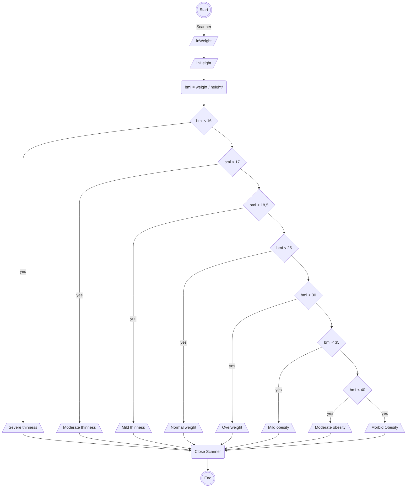

#Java Project Body Mass Index

```mermaid

flowchart 
    A(((Start))) -->|Scanner| B[/inWeight/]
    B --> C[/inHeight/]
    C --> D("bmi = weight / height²")
    D --> E{bmi < 16} --> |yes| e'[/Severe thinness\]
    E --> F{bmi < 17} --> |yes| f'[/Moderate thinness\]
    F --> G{bmi < 18,5} --> |yes| g'[/Mild thinness\]
    G --> H{bmi < 25} --> |yes| h'[/Normal weight\]
    H --> I{bmi < 30} --> |yes| i'[/Overweight\]
    I --> J{bmi < 35} --> |yes| j'[/Mild obesity\]
    J --> K{bmi < 40} --> |yes| k'[/Moderate obesity\]
    K --> |yes| L[/Morbid Obesity\]
    e' --> M(Close Scanner)
    f' --> M
    g' --> M    
    h' --> M    
    i' --> M
    j' --> M
    k' --> M
    L --> M
    M --> N(((End)))


```
